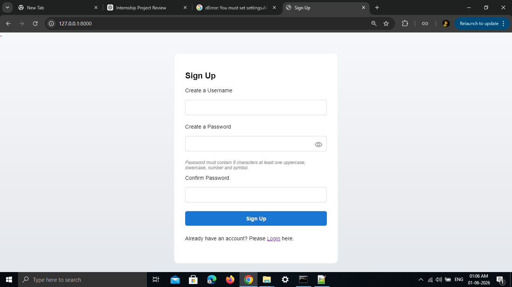
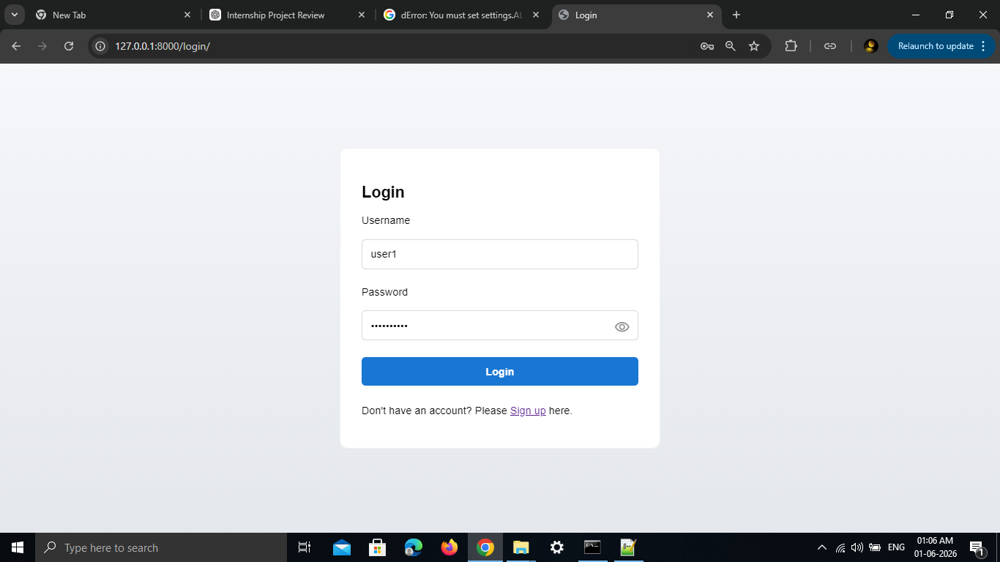
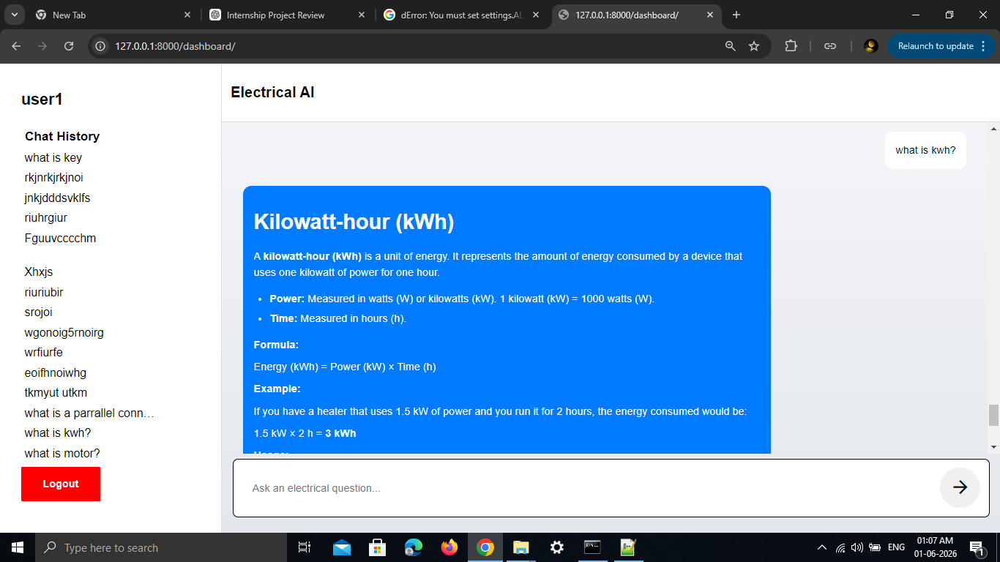

# Electrical Machines Q&A Platform

A Django-based web application that allows authenticated users to ask electrical engineering and electrical machine related questions and receive AI-generated answers.

## Features

* User Registration
* User Authentication (Login/Logout)
* Electrical Engineering Q&A System
* AI-Powered Answers using Gemini API
* MySQL Database Integration
* Question History Sidebar
* Responsive Mobile-First Design
* Markdown Formatted Answers
* Ubuntu/Linux Deployment Support

---

## Technology Stack

### Backend

* Django 5.2
* MySQL
* Google Gemini API

### Frontend

* HTML
* CSS
* JavaScript

### Additional Libraries

* python-dotenv
* Markdown
* mysqlclient

---

## Database Design

### User

Django's built-in authentication system is used.

### Question

| Field      | Type             |
| ---------- | ---------------- |
| id         | AutoField        |
| user       | ForeignKey(User) |
| question   | TextField        |
| answer     | TextField        |
| created_at | DateTimeField    |

---

## Screenshots

### Signup Page


### Login



### Dashboard




---

## Installation Guide

### Clone Repository

```bash
git clone <repository-url>
cd intern_full_stack_development
```

### Create Virtual Environment

```bash
python -m venv venv
```

### Activate Virtual Environment

Windows:

```bash
venv\Scripts\activate
```

Linux:

```bash
source venv/bin/activate
```

### Install Dependencies

```bash
pip install -r requirements.txt
```

---

## Environment Variables

Create a `.env` file in the project root.

```env
GEMINI_API_KEY=your_api_key

DB_NAME=electrical_ai
DB_USER=root
DB_PASSWORD=your_password
DB_HOST=localhost
DB_PORT=3306
```

---

## MySQL Setup

Create the database:

```sql
CREATE DATABASE electrical_ai;
```

---

## Run Migrations

```bash
python manage.py makemigrations
python manage.py migrate
```

---

## Run Development Server

```bash
python manage.py runserver
```

Application will be available at:

```text
http://127.0.0.1:8000
```

---

# Ubuntu Deployment Guide

## Update Packages

```bash
sudo apt update
```

## Install Required Packages

```bash
sudo apt install git
sudo apt install python3-pip
sudo apt install python3-venv
sudo apt install mysql-server
sudo apt install pkg-config
sudo apt install default-libmysqlclient-dev
```

## Clone Repository

```bash
git clone <repository-url>
cd intern_full_stack_development
```

## Create Virtual Environment

```bash
python3 -m venv venv
source venv/bin/activate
```

## Install Requirements

```bash
pip install -r requirements.txt
```

## Configure Environment Variables

Create `.env`

```env
GEMINI_API_KEY=your_api_key

DB_NAME=electrical_ai
DB_USER=root
DB_PASSWORD=your_password
DB_HOST=localhost
DB_PORT=3306
```

## Configure MySQL

```bash
sudo mysql
```

```sql
CREATE DATABASE electrical_ai;
```

## Apply Migrations

```bash
python manage.py migrate
```

## Start Server

```bash
python manage.py runserver 0.0.0.0:8000
```

---

## Project Structure

```text
electrical_qa/
│
├── qa/
├── templates/
├── static/
├── screenshots/
├── requirements.txt
├── README.md
├── .env
└── manage.py
```

---

## Author

Vetrivel

Full Stack Development Internship Assignment Submission
